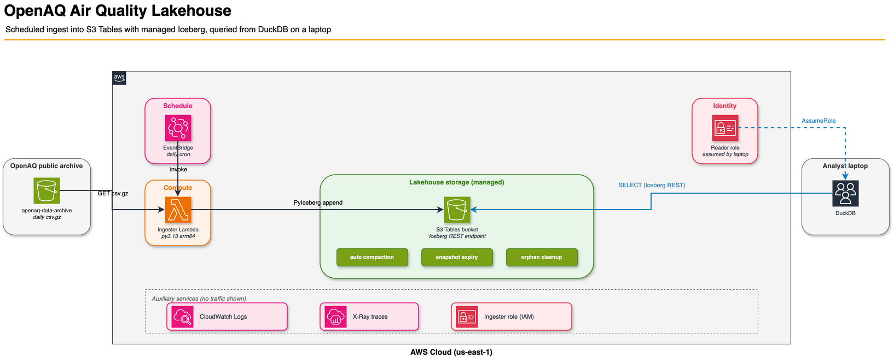

# OpenAQ Lakehouse on Amazon S3 Tables and DuckDB

A working reference implementation of a managed Iceberg lakehouse built on Amazon S3 Tables, fed by an AWS Lambda ingester pulling from the public OpenAQ air-quality archive, and queried from DuckDB on your laptop.

Walkthrough: [Serverless Analytics from Your Laptop: S3 Tables, DuckDB, and an OpenAQ Lakehouse](https://darryl-ruggles.cloud/serverless-analytics-from-your-laptop-s3-tables-duckdb-and-an-openaq-lakehouse/) on darryl-ruggles.cloud.



## What this project does

- Provisions an S3 Tables bucket with two Iceberg tables (`measurements`, `locations`).
- Deploys a Python 3.13 Lambda function on Graviton (arm64) that:
  - Pulls daily gzipped CSVs from the public `openaq-data-archive` S3 bucket.
  - Normalizes the rows.
  - Appends to the Iceberg tables via PyIceberg + the S3 Tables Iceberg REST endpoint.
- Sets up a (disabled-by-default) EventBridge schedule for ongoing daily ingestion.
- Creates a least-privilege ingester role and a separate read-only role for analyst sessions.
- Provides DuckDB SQL files for queries, time travel, INSERT/UPDATE/DELETE, and local-to-cloud migration.
- Provides a small React + Vite browser UI plus a local Python query API so you can click around the lakehouse without dropping into a SQL prompt.

## Requirements

- An AWS account with permissions to create S3 Tables, Lambda, IAM, EventBridge Scheduler, and S3 resources.
- Region: `us-east-1` by default (S3 Tables is GA in `us-east-1`, `us-east-2`, and `us-west-2`. Override `aws_region` in `terraform.tfvars` if you want a different region.)
- Local tools:
  - [Terraform](https://developer.hashicorp.com/terraform) >= 1.10
  - [uv](https://docs.astral.sh/uv/) (Python project manager)
  - [DuckDB CLI](https://duckdb.org/docs/installation/) (`brew install duckdb` on macOS) - needed for `make query`. The Python `duckdb` package this project depends on is a library only.
  - Node.js 20+ and npm (only for the optional frontend)
  - AWS CLI v2 with a configured profile

## AWS profile

The Makefile defaults `AWS_PROFILE` to `default`. Override on the command line:

```bash
make apply AWS_PROFILE=my-profile
```

Or copy `infrastructure/terraform.tfvars.example` to `infrastructure/terraform.tfvars` and set:

```hcl
aws_profile = "my-profile"
aws_region  = "us-east-1"
```

## Quick start

```bash
# Install Python deps and Terraform providers.
make init

# Build the Lambda layer (PyIceberg, pyarrow, Powertools) and the function zip.
make layer
make package

# terraform plan, then apply.
make plan
make apply

# Invoke the ingester. Defaults: 500 stations x 30 days.
# Override sizing via STATIONS and DAYS, or use `make ingest-large` for the
# bigger benchmark workload (5000 stations x 365 days).
make ingest

# Open DuckDB attached to the lakehouse.
make query
```

Inside DuckDB:

```sql
-- See what tables exist.
SHOW ALL TABLES;

-- Run the query battery.
.read 02_query_basics.sql
.read 03_time_travel.sql
.read 04_writes.sql
```

## Cleanup

```bash
# Truncate every table via DuckDB so terraform destroy can drop them.
make empty-tables

# Tear down everything.
make destroy

# Remove local build artifacts.
make clean
```

The S3 Tables bucket, namespace, and tables can't be destroyed while they hold data; `make empty-tables` runs a small DuckDB session that issues `DELETE FROM` against each table first, producing a final empty snapshot. After that, `terraform destroy` succeeds.

## Cost

The default (schedule disabled, no live ingestion) runs you a few cents per month for the artifacts S3 bucket, the layer storage, and the CloudWatch log group with 14-day retention.

If you flip `schedule_state = "ENABLED"` in `terraform.tfvars`, the daily Lambda invocation costs roughly $0.005 per month plus minor S3 Tables charges scaling with the data you ingest. See `docs/cost.md` if added, or estimate from the AWS Pricing Calculator with these rates:

- S3 Tables storage: $0.0265/GB/month
- Object monitoring: $0.025 per 1,000 objects/month
- Compaction (binpack): $0.002 per 1,000 objects + $0.005/GB processed
- Lambda Graviton: $0.0000133334/sec at 1769 MB

## Layout

```
.
|-- infrastructure/        # Terraform: s3 tables, namespace, tables, lambda, IAM, schedule
|-- ingester/              # Python 3.13 Lambda source + tests
|   |-- src/handler.py     # Powertools entry point
|   |-- src/openaq.py      # OpenAQ source fetcher
|   |-- src/iceberg_writer.py  # PyIceberg writes via S3 Tables Iceberg REST
|   `-- tests/             # pytest
|-- duckdb/                # SQL files for setup, queries, time travel, writes, migration
|-- scripts/               # bench, seed_local, empty_tables
|-- frontend/              # Optional React + Vite UI talking to scripts/local_api.py (see frontend/README.md)
|-- docs/                  # Architecture diagram, perf results
|-- Makefile               # init, plan, apply, ingest, query, destroy
`-- pyproject.toml         # uv-managed python project
```

## Development

```bash
make fmt       # ruff format + terraform fmt
make lint      # ruff check + mypy + terraform fmt -check + validate
make test      # pytest
make bench     # capture latency benchmarks into docs/perf.md
make logs      # tail the ingester's CloudWatch log group
```

## Frontend (optional)

There's a small React + Vite app under `frontend/` that gives you a browser UI for the lakehouse: pre-canned queries in a sidebar, a SQL editor (Cmd/Ctrl+Enter to run), a results table, and a line chart for the time-series query.

It does NOT use DuckDB-Wasm directly. The browser talks to a tiny Python sidecar (`scripts/local_api.py`) over `localhost:8000`, which holds one DuckDB process attached to the S3 Tables catalog using your local AWS credential chain. AWS credentials never reach the browser, and you don't have to fight CORS against the S3 Tables Iceberg REST endpoint.

Run it in two terminals:

```bash
make local-api    # terminal 1: starts http://localhost:8000
make frontend     # terminal 2: starts http://localhost:5173
```

See `frontend/README.md` for layout and notes on swapping in DuckDB-Wasm if you want a credential-free deployment.

## Configuration reference

Variables exposed in `infrastructure/variables.tf`:

| Variable | Default | Notes |
|---|---|---|
| `aws_region` | `us-east-1` | S3 Tables is GA in us-east-1, us-east-2, us-west-2. |
| `aws_profile` | `default` | Named profile for the AWS provider. |
| `project` | `openaq-lakehouse` | Used as the resource-name prefix. |
| `namespace_name` | `airquality` | Iceberg namespace inside the table bucket. |
| `lambda_memory_mb` | `1769` | 1 vCPU break point. Higher gives more vCPU. |
| `lambda_timeout_s` | `900` | 15 minutes hard ceiling. |
| `log_retention_days` | `14` | CloudWatch Logs retention. |
| `schedule_state` | `DISABLED` | Flip to `ENABLED` for daily ingest. |
| `schedule_expression` | `cron(0 6 * * ? *)` | Daily at 06:00 UTC. |
| `schedule_payload` | `{"stations": 500, "days": 1}` | Sent to the Lambda by the schedule. |
| `tags` | project=openaq-lakehouse, managedBy=terraform | Default tags on every taggable resource. |

## Versions

Pinned at the time of writing (May 2026):

- Terraform >= 1.10
- hashicorp/aws ~> 6.43
- Python 3.13
- DuckDB 1.5.2
- PyIceberg 0.11.x
- pyarrow 22.x
- aws-lambda-powertools 3.28+

## More context

The full design notes, performance numbers, cost analysis, and production-hardening checklist are in the companion blog post: [Serverless Analytics from Your Laptop](https://darryl-ruggles.cloud/serverless-analytics-from-your-laptop-s3-tables-duckdb-and-an-openaq-lakehouse/).

## License

MIT. See `LICENSE`.
